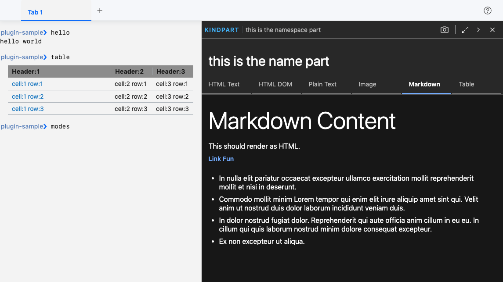

# Kui Sample Plugin/External Client for kubectl

[](https://travis-ci.org/kui-shell/plugin-sample)
[](https://opensource.org/licenses/Apache-2.0)

This project demonstrates how to develop for
[Kui](https://github.com/IBM/kui). With this repo as a basis, you can
author a Kui plugin, and optionally ship it as custom
[Electron](https://electronjs.org) or [Webpack](https://webpackjs.org)
client.

# Clone and Own the Repo

```bash
git clone https://github.com/kui-shell/plugin-sample
cd plugin-sample
npm install
```

# How this Project extends Kui

This project demonstrates adding three commands to Kui: 
- **sample hello**: the obligate hello world, a command that returns a
  string. [Source](plugins/plugin-sample/src/lib/cmds/say-hello.ts)
- **sample table**: a command that emits a table in the REPL output with
  clickable rows; each row click will open an entity in the
  sidecar. [Source](plugins/plugin-sample/src/lib/cmds/table.ts)
- **sample modes**: a command that produces a multi-modal response that is
  displayed in the
  sidecar. [Source](plugins/plugin-sample/src/lib/cmds/modes.ts)
  
It also installs a fourth, `sample show row`, that is used in service
of the `onclick` handler for the rows of the `sample table` output.



# Local Development with Electron

To develop your plugin, it is convenient to run it against a local
electron client. To do so, issue this command:

```bash
npm start
```

You should see a window come up. This sample project introduces a
command `modes`. Try it out and see the result!

# Watchers

This example is coded in
[TypeScript](https://www.typescriptlang.org/). For a quick edit-debug
loop, you can launch a TypeScript watcher, and then launch the stock
electron client. Then, after every change you make to a `.ts` source
file, a simple reload (Command/Ctrl+R) in the electron client will
manifest your changes.

```bash
npm start      # <-- this launches the stock electron client
npm run watch  # <-- this launches the TypeScript watcher
```

# Webpack

You may also test against a webpack build. Assuming you have already
launched a TypeScript watcher, you can also launch a Webpack watcher:

```bash
npm run watch:webpack  # <-- this launches a webpack-dev-server
```

Then, visit `http://localhost:9080` to see your client in any browser.

# Proxy

By default, webpack clients have no backend. For this sample plugin,
that is sufficient, as none of the sample commands communicate to the
outside world. Once you do so, you may find a need for a backend. Kui
offers this via the Kui Proxy.

```bash
npm run proxy   # <-- this launches a proxy
```

# Guide to the Directory Structure

This is the layout of a Kui project:

```
├── plugins/
│   └── plugin-sample/
├── theme/
│   ├── css/
│   ├── icons/
│   ├── images/
│   ├── config.json
│   └── theme.json
├── tsconfig.json
```

This structure allows you to maintain a hierarchical structure to your
plugins. For example, if multiple teams are developing loosely related
extensions, each can have a subdirectory under [plugins/](plugins/). In this
example project, we have only one such subdirectory.

# Theming

If your end goal is to ship a plugin, then you may skip this
section. If you would rather ship an electron or webpack client of
your own, you have the option to customize the theming in several
ways. These changes are captured in the `theme/` subdirectory. More
details coming soon. For now, browse the
[theme.json](theme/theme.json) file.

